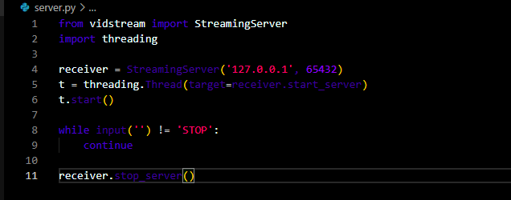
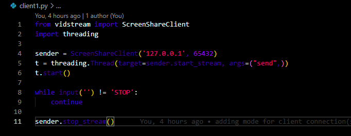
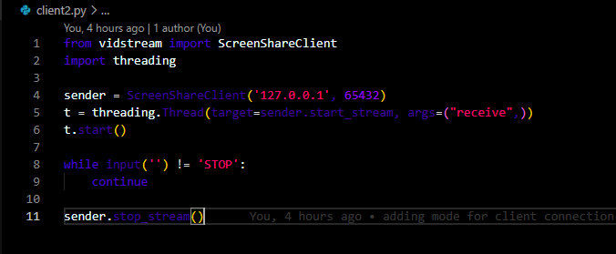

# Vidstream-Updated-
### Updating Vidstream package
- Making server to handle multiple clients connection
- Server broadcast received frame to all connected clients except the one who send the frame
- The video to be displayed to the client and not server

#### Example

